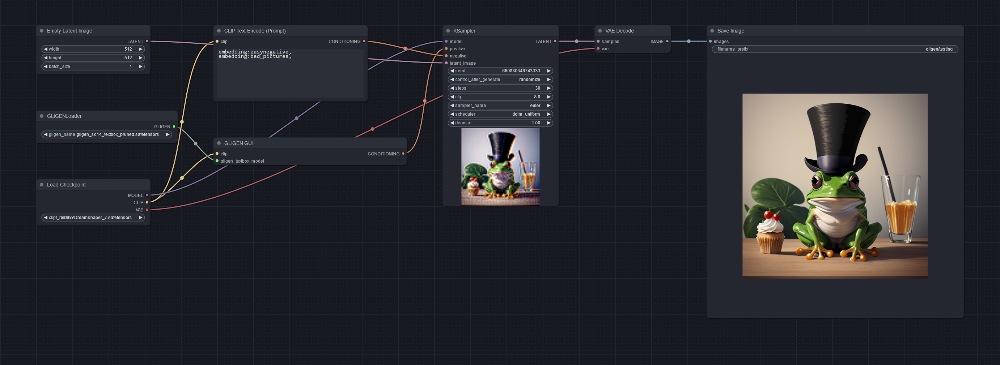

# ComfyUI GLIGEN GUI Node

This is a simple, straightforward ComfyUI node to be used along with the GLIGEN GUI I developed.

## Installation
Clone this repository into the ComfyUI "custom_nodes" directory, and then restart ComfyUI.

## Workflow
The workflow goes like this:

1. [Make sure you have the GLIGEN GUI up and running](https://github.com/mut-ex/gligen-gui/tree/main)
2. Create your composition in the GUI
3. In the ComfyUI, use the GLIGEN GUI node to replace the *positive* **"CLIP Text Encode (Prompt)"** and the **"GLIGENTextBoxApply"** node like in the following workflow. The node will grab the boxes and gather the prompt and output the final positive conditioning. This allows you greater control/flexibility with how you incorporate GLIGEN in your own workflows.

